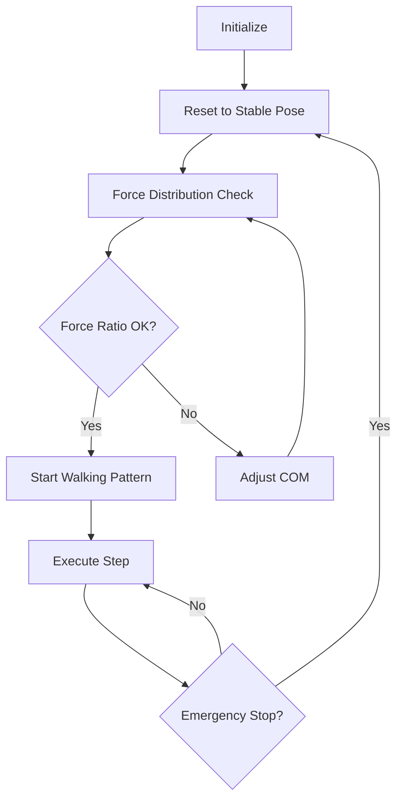

# System Architecture Documentation

## Overview
The bipedal robot walking system is built on a force-aware control architecture that maintains stability through continuous force distribution monitoring and adaptive walking pattern generation.

## System Components

### 1. Robot Model (URDF)
```
simple_biped_stable.urdf
├── Base Link (Torso)
├── Left Leg
│   ├── Hip Joint (Revolute)
│   ├── Knee Joint (Revolute)
│   └── Ankle Joint (Fixed)
└── Right Leg
    ├── Hip Joint (Revolute)
    ├── Knee Joint (Revolute)
    └── Ankle Joint (Fixed)
```

### 2. Control Architecture
```
Walking Controller
├── State Management
│   ├── Robot State Monitor
│   ├── Force Distribution Monitor
│   └── Stability Monitor
├── Motion Planning
│   ├── Walking Pattern Generator
│   ├── Inverse Kinematics Solver
│   └── Trajectory Optimizer
└── Control Execution
    ├── Joint Position Controller
    ├── Force Feedback Controller
    └── Emergency Stop Manager
```

## Key Algorithms

### 1. Force Distribution Control
```python
def _adjust_com_position(self):
    """
    Adjusts the Center of Mass position based on force feedback:
    1. Measures force distribution between feet
    2. Calculates required COM adjustment
    3. Applies smooth transition using exponential scaling
    4. Verifies force ratio improvement
    """
```

### 2. Walking Pattern Generation
```python
def generate_walking_pattern(self):
    """
    Generates walking patterns with:
    1. Pre-walking stabilization phase
    2. Weight transfer phase
    3. Swing leg trajectory
    4. Landing position optimization
    """
```

### 3. Inverse Kinematics
```python
def inverse_kinematics(self):
    """
    Calculates joint angles using:
    1. Geometric approach for leg chain
    2. Joint limit verification
    3. Singularity handling
    4. Solution optimization
    """
```

## Data Flow
1. Force Sensors → Force Distribution Monitor
2. Force Monitor → COM Adjustment Calculator
3. COM Calculator → Joint Position Controller
4. Pattern Generator → Trajectory Optimizer
5. Trajectory Optimizer → Joint Controller

## Control Flow


## Performance Characteristics

### 1. Force Distribution
- Target ratio: 0.85
- Acceptable range: 0.75 - 0.95
- Convergence time: < 2.0s

### 2. Walking Parameters
- Step length: 0.08m
- Step height: 0.04m
- Cycle time: 1.2s
- Startup time: 2.0s

### 3. Stability Metrics
- Maximum pitch deviation: ±5°
- Minimum ground force: 180N
- Force ratio convergence: 0.800

## Safety Systems

### 1. Emergency Stop Conditions
- Force ratio outside range
- Excessive pitch deviation
- Zero ground contact
- Joint limit violation

### 2. Recovery Procedures
- Reset to stable pose
- Force redistribution
- Gradual motion resumption

## System Integration

### 1. PyBullet Integration
```python
class URDFWalker:
    """
    Handles PyBullet simulation interface:
    1. Robot state management
    2. Physics simulation
    3. Contact point handling
    4. Force measurement
    """
```

### 2. Control Interface
```python
class WalkingController:
    """
    Main control interface providing:
    1. High-level walking commands
    2. State monitoring
    3. Safety management
    4. Performance logging
    """
```

## Future Extensions

### 1. Planned Improvements
- Dynamic gait adaptation
- Terrain awareness
- Energy optimization
- Learning-based control

### 2. Integration Points
- ROS interface
- External sensor integration
- Remote control interface
- Data logging system

## System Requirements

### 1. Hardware Requirements
- CPU: Multi-core processor
- Memory: 4GB+ RAM
- GPU: Optional, improves simulation speed

### 2. Software Requirements
- Python 3.12
- PyBullet
- NumPy 2.x
- Ubuntu 22.04+

## Error Handling

### 1. Common Failure Modes
- Force distribution divergence
- IK solution failure
- Joint limit violations
- Simulation instability

### 2. Recovery Strategies
- Automatic pose reset
- Adaptive step adjustment
- Force-based stabilization
- Emergency stop protocol
